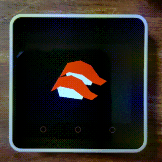

# Overview / 概要

The m5core2_mawaranai_sushi project is a non-rotating sushi renderer for the [M5Stack Core 2](https://docs.m5stack.com/#/en/core/core2) .

In Japan, ‘mawaranai sushi’ (non-rotating sushi) means high-end sushi restaurants where sushi is served directly to you, rather than moving on a conveyor belt like its cheaper counterparts. Inspired by this noble tradition, I created a humorous project that ensures digital sushi stays 'non-rotating'—even when you physically rotate the M5Stack itself.

Note: The M5Stack Core2 doesn’t have a compass, so don’t be surprised if sushi starts to drift a bit. It’s all part of the fun! :)

\[日本語\]

m5core2_mawaranai_sushi プロジェクトは、回らない寿司を描画する [M5Stack Core 2](https://docs.m5stack.com/#/en/core/core2) 用のソフトウェアです。

なお、M5Stack Core2にはコンパスがありません。したがって、実のところ寿司は少しドリフトします…。

# Video / ビデオ




# Installation / インストール

1. Clone the repository:
    ```sh
    git clone https://github.com/cubic9com/m5core2_mawaranai_sushi.git
    cd m5core2_mawaranai_sushi
    ```

2. Install [Visual Studio Code](https://code.visualstudio.com/) if you haven't already.

3. Open the project using Visual Studio Code:
    ```sh
    code .
    ```

4. Install `PlatformIO IDE` extension:
    - Go to the Extensions view (`Ctrl+Shift+X`).
    - Search for `PlatformIO IDE` and install it.

5. Open PlatformIO Home:
    - In the left Activity Bar, click PlatformIO icon.
    - In the left Primary Sidebar, go to `QUICK ACCESS > PIO Home > Open`.

6. Open the project:
    - In the right Editor Group, click `Open Project` in the `PIO HOME` tab.
    - Select the cloned `m5core2_mawaranai_sushi` project folder.

7. Build and upload the project:
    - In the left Primary Sidebar, go to `PROJECT TASKS > m5stack-core2 > General > Upload`.

\[日本語\]

1. リポジトリをクローンします:
    ```sh
    git clone https://github.com/cubic9com/m5core2_mawaranai_sushi.git
    cd m5core2_mawaranai_sushi
    ```

2. まだインストールしていない場合は、[Visual Studio Code](https://code.visualstudio.com/) をインストールします。

3. Visual Studio Code でプロジェクトを開きます:
    ```sh
    code .
    ```

4. `PlatformIO IDE` 拡張機能をインストールします:
    - 左サイドバーの「拡張機能」ビュー (`Ctrl+Shift+X`) を開きます。
    - `PlatformIO IDE` を検索してインストールします。

5. PlatformIO Home を開きます:
    - 左のアクティビティバーで PlatformIO アイコンをクリックします。
    - 左のメインサイドバーから `QUICK ACCESS > PIO Home > Open` を選択します。

6. プロジェクトを開きます:
    - 右のエディターグループ内の `PIO HOME` タブで `Open Project` をクリックします。
    - クローンした `m5core2_mawaranai_sushi` プロジェクトフォルダーを選択します。

7. プロジェクトをビルド＆アップロードします:
    - 左のメインサイドバーから `PROJECT TASKS > m5stack-core2 > General > Upload` を選択します。

# License / ライセンス

Copyright (C) 2025, cubic9com All rights reserved.

This project is licensed under the MIT license.

See the `LICENSE` file for details.
